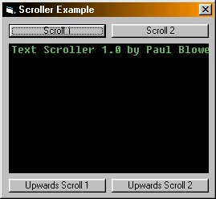



## A Scroller OCX \- Smoothly scrolls text in a picturebox \(full OCX source\+example\)

### Description

This is an Active X control you can add to your apps

and have nice, smoothly scrolling text which makes them

look pretty good :) 

The ocx can scroll right->left or bottom->top and background+text

colors are customisable. Text scrolls, optionally pauses at the edge for specified ms and then continues to scroll off 

It uses bitblt to do the drawing so its flickerless and goes pretty smoothly. 

Also, this code simulates an asynchronus function as i couldnt see a way to make/call an asynchronus function in vb.

Please vote for it!
 
### More Info
 

             |
---                |---
**Submitted On**   |2001-02-03 16:13:44
**By**             |[Mercior](https://github.com/Planet-Source-Code/PSCIndex/blob/master/ByAuthor/mercior.md)
**Level**          |Advanced
**User Rating**    |4.7 (47 globes from 10 users)
**Compatibility**  |VB 6\.0
**Category**       |[Custom Controls/ Forms/  Menus](https://github.com/Planet-Source-Code/PSCIndex/blob/master/ByCategory/custom-controls-forms-menus__1-4.md)
**World**          |[Visual Basic](https://github.com/Planet-Source-Code/PSCIndex/blob/master/ByWorld/visual-basic.md)
**Archive File**   |[CODE\_UPLOAD14514242001\.zip](https://github.com/Planet-Source-Code/mercior-a-scroller-ocx-smoothly-scrolls-text-in-a-picturebox-full-ocx-source-example__1-14967/archive/master.zip)

